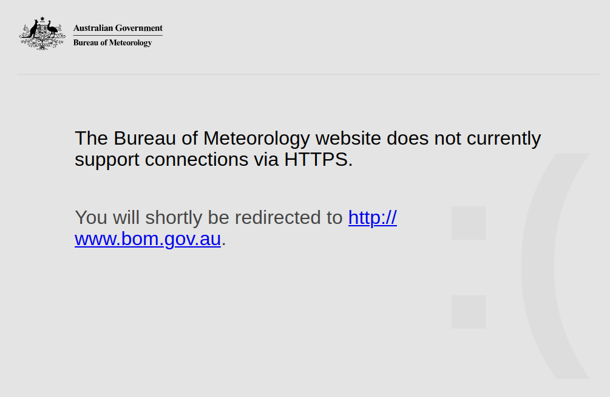
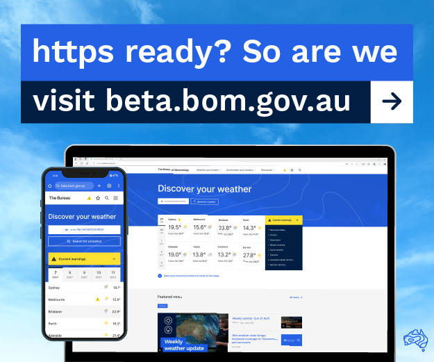

# BOM Secure Redirect

A Firefox browser extension for redirecting Bureau of Meteorology (BOM) to HTTPS enabled site and optionally legacy homepage.

## Background

If ever visiting the BOM website in the past, chances are you were greeted by an 'Insecure' warning and/or message about limited HTTPS support. For historical or other reasons, the BOM stuck out as one of a few major web properties yet to move off plain old HTTP :(

Lesser known is the BOM seemed to long make a HTTPS enabled mirror of the site available at https://reg.bom.gov.au. Enter this extension.

In June 2024, the beta.bom.gov.au test site was [announced](https://web.archive.org/https://media.bom.gov.au/releases/1229/bureau-of-meteorologys-new-test-website-now-available-to-the-community) and subsequently [made live](https://www.bom.gov.au/news-and-media/the-bureau-of-meteorologys-new-website-is-now-live) in October 2025. The new site including full HTTPS support!

 

With the launch of the new BOM website, this extension now serves limited purpose in redirecting the remaining https://bom.gov.au domain URL without a functional server-side redirect. As well as providing an option to redirect from the new homepage, to the legacy site still running at https://reg.bom.gov.au for those who prefer the old format.

This legacy redirection option can be found under extension Preferences.

## Other

The extension is built to the latest Manifest V3 specification, leveraging the rule-based [declarativeNetRequest](https://developer.mozilla.org/docs/Mozilla/Add-ons/WebExtensions/API/declarativeNetRequest#comparison_with_the_webrequest_api) API

Latest Firefox releases should prompt for required permissions (to www.bom.gov.au and bom.gov.au) on extension install. To check permissions have been granted, click the Extensions toolbar icon > Manage extensions > BOM Secure Redirect > Permissions tab, and ensure both entries are toggled on

Extension icon adapted from the [BOM Weather](https://www.bom.gov.au/bom-weather-app) app logo
